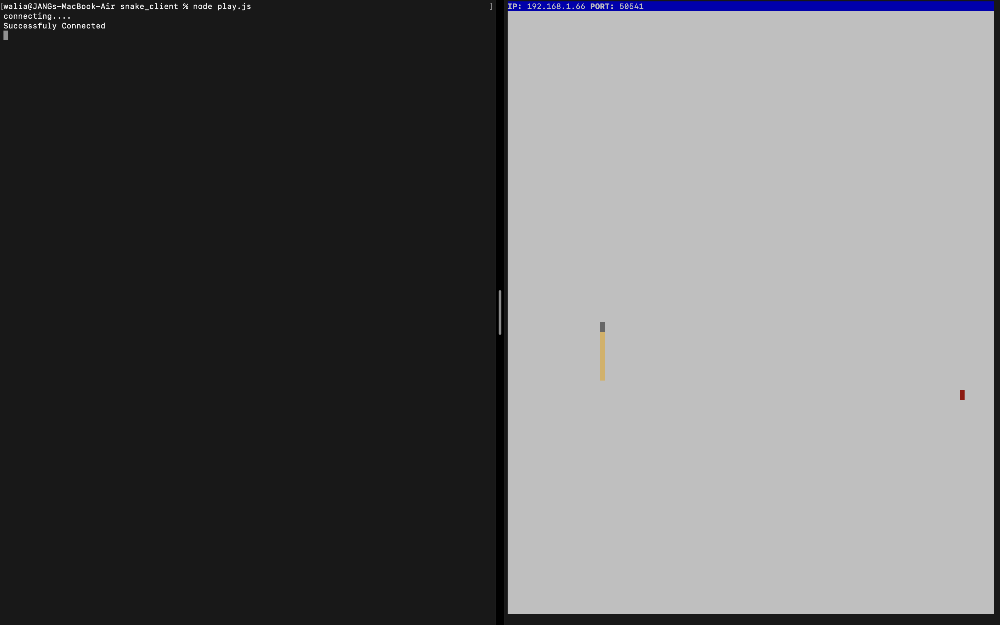

# Snake Client Project

Snake game is a very popular video game. It is a video game concept where the player maneuvers a dot and grows it by ‘eating’ pieces of food. As it moves and eats, it grows and the growing snake becomes an obstacle to smooth maneuvers. The goal is to grow it to become as big as possible without bumping into the side walls, or bumping into itself, upon which it dies.

This is simply a multiplayer take on the genre.

Before you can run this client, you will need to be running the server side which you can download and install from here. 

## Final Product




## Getting Started

- Follow steps inside the snek server repo to run the server side
- Run the development snake client using the `node play.js` command.

## Client Set UP

### Create a play.js file and created  a myfunc function which create new connection

``` javascript
const net = require("net");

// establishes a connection with the game server
const myfunc = function () {
  const conn = net.createConnection({
    host: // IP address here,
    port: // PORT number here,
  });

  // interpret incoming data as text
  conn.setEncoding("utf8");

  return conn;
};

console.log("Connecting ...");
myfunc();

```
### The game server automatically places your snake on the board as soon as you establish the connection. If you've set it up correctly, you should see your snake appear briefly in the live video stream.

# Handle Messages From Server
``` javascript
conn.on('data', (data) => {
    console.log("server says :", data);
  })
```
### Once you implement this event handler, you should see a message sent to you from the server when it kicks out your snake for idling...


# A Separate Module For The TCP Connection

## create seperate file called client.js
``` javascript
const net = require("net");
const {host,port,msg,username} = require('./constants');
//declaring connect function
const myfunc = () => {
  const conn = net.createConnection({
    host: host,
    port: port
  });
  conn.setEncoding("utf8");
  conn.on('connect', () => {
    console.log(msg);
    conn.write(username);
  })
  //get a msg from server when connected
  conn.on('data', (data) => {
    console.log("server says :", data);
  })
  // interpret incoming data as text

  return conn;
}
//exporting connect function
module.exports = { myfunc }
```
- Move the myfunc function from play.js into client.js.
- Now that you've moved the myfunc function, you will need to export it from client.js so it can be used by play.js. Read this refresher on exports in Node before doing so.

## Use Destructuring Object method in play.js
 ``` javascript
const { myfunc } = require('./client');
const { setupInput } = require('./input');
// establishes a connection with the game server
//calling the function using destructuring 
console.log('connecting....')
let conn = myfunc();
//passing conn object to setInput function to use in input file
setupInput(conn);
```
# WASD Movement and Constant Module

### created an array for all the movements and stores it with other constant values in different file named constant.js 
``` javascript
const host = "localhost";
const port = 50541;
const msg = "Successfuly Connected";
const username = "Name: JSW";
//sending directions as an object
const keyData = {
  w : "Move: up",
  a : "Move: left",
  s : "Move: down",
  d : "Move: right",
  z : "Say: Hello"
}
module.exports = {
  host,
  port,
  msg,
  username,
  keyData
}
```


